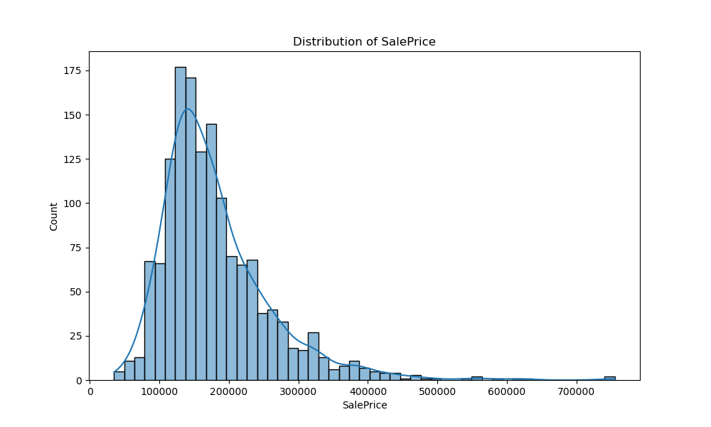
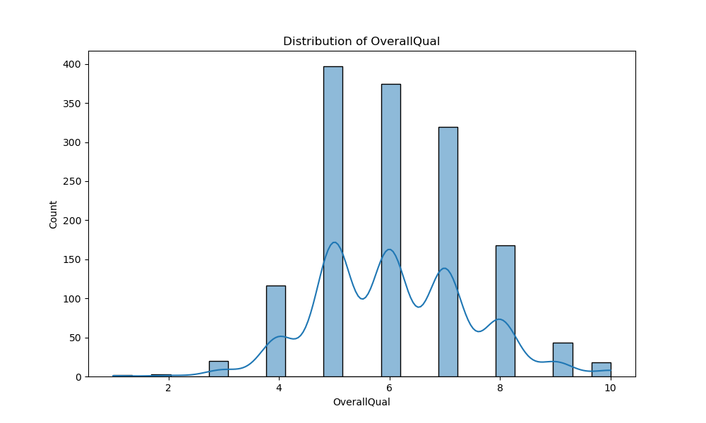
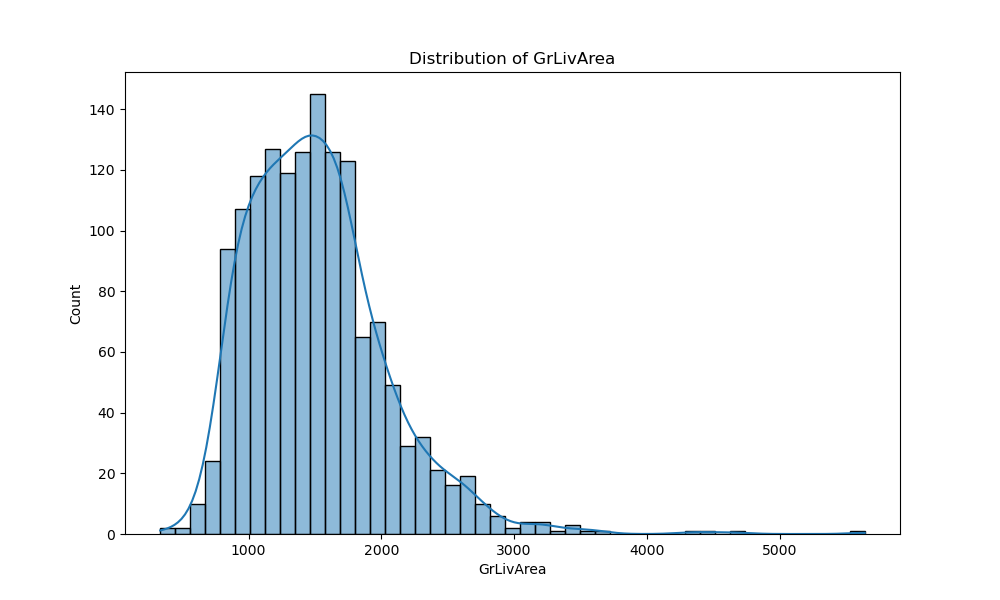
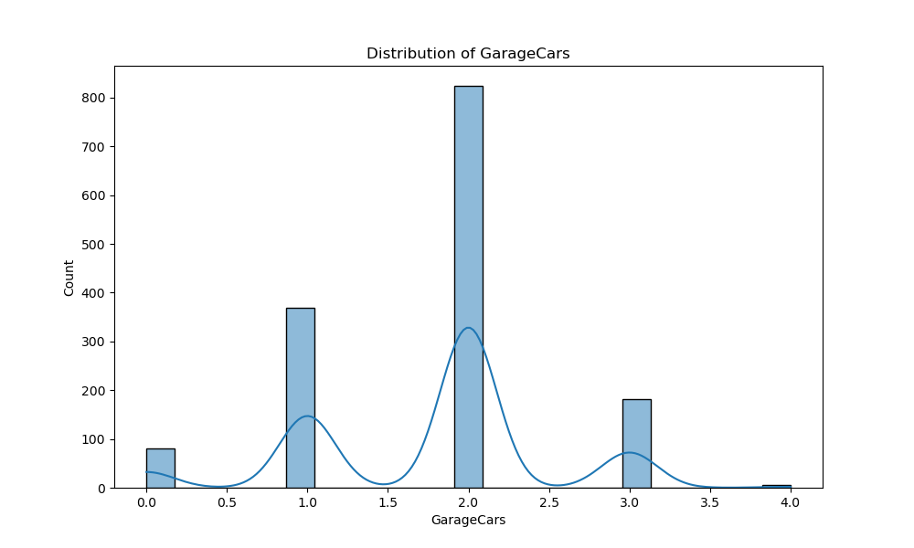
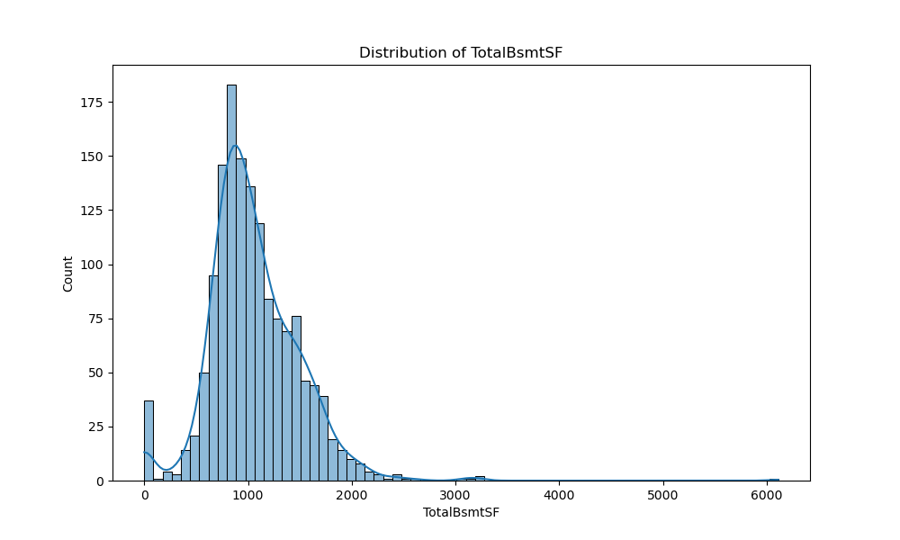
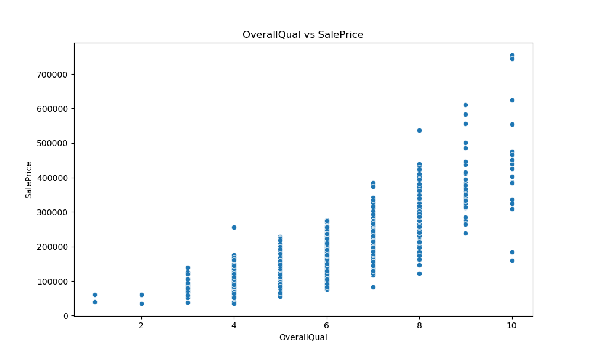
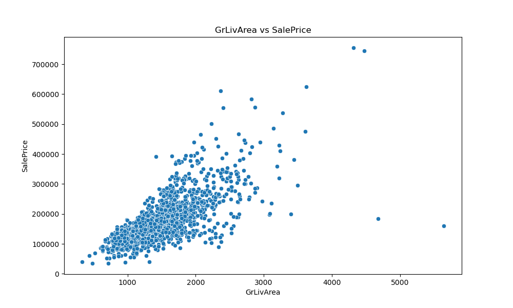
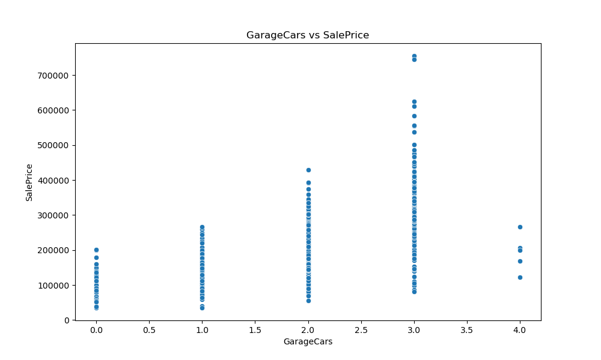
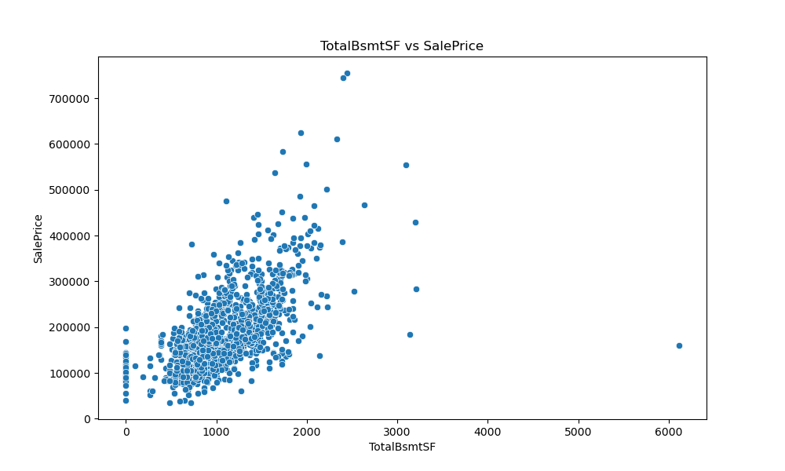

# Experiment Report: House Price Prediction

## 1. Experiment Overview
This experiment tested the hypothesis that features like Overall Quality, Above Ground Living Area, Garage Capacity, and Total Basement Area could effectively predict house prices using a RandomForestRegressor model.

## 2. Exploratory Data Analysis (EDA)

### Target Variable Distribution

The target variable 'SalePrice' shows a right-skewed distribution with most prices clustered around $150,000-$250,000.

### Feature Distributions

Most features show reasonable distributions suitable for modeling.

### Feature-Target Relationships

All selected features show clear positive relationships with house prices, with Overall Quality and Living Area showing particularly strong correlations.

## 3. Model Training & Results
- **Model**: RandomForestRegressor
- **Features**: ['OverallQual', 'GrLivArea', 'GarageCars', 'TotalBsmtSF']
- **Hyperparameters**: n_estimators=100, random_state=42
- **Metrics**:
  - R² Score: 0.882
  - RMSE: $30,024.14

## 4. Hypothesis Evaluation
The experiment **strongly supports** the hypothesis. The model achieved an excellent R² score of 0.882, indicating that 88.2% of the variance in house prices is explained by the selected features. The clear positive relationships observed in the EDA visualizations and the strong model performance both validate the hypothesis that these features are effective predictors of house prices.

## 5. Conclusion
The selected features (Overall Quality, Living Area, Garage Capacity, and Basement Area) are all significant predictors of house prices. The RandomForestRegressor model performed exceptionally well, suggesting that this feature set is well-suited for house price prediction tasks. Future work could explore feature engineering to further improve model performance or test other regression algorithms for potential enhancements.